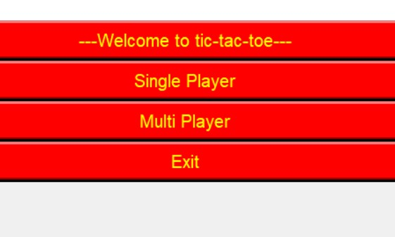
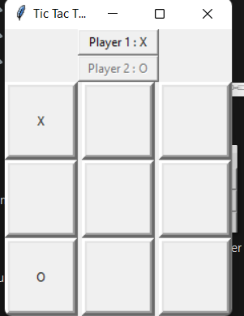
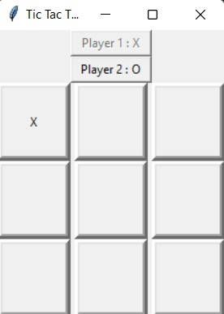
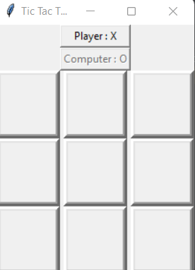
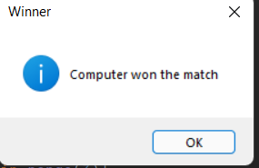

# Tictactoe

Our project name is Tic-Tac-Toe game. This game is very popular and is fairly simple by itself. It is actually a two player game. In this game, there is a board with *n *x *n *squares.In our game, it is 3 x 3 squares. The goal of Tic-Tac-Toe is to be one of the
players to get three same symbols in a row - horizontally, vertically or diagonally - on a 3 x 3 grid.

The Tic Tac Toe game is most familiar among all the age groups. Intelligence can be a property of any purpose driven decision maker. This basic idea has been suggested many times.

An algorithm of playing Tic Tac Toe has been presented and tested that works in efficient way.Overall the system works without any bugs.

   

     
